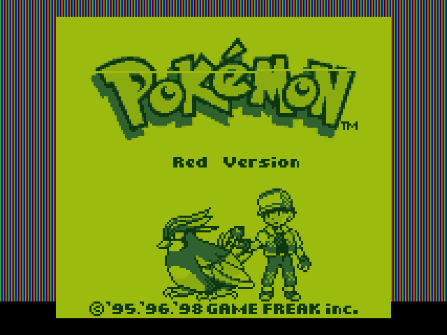
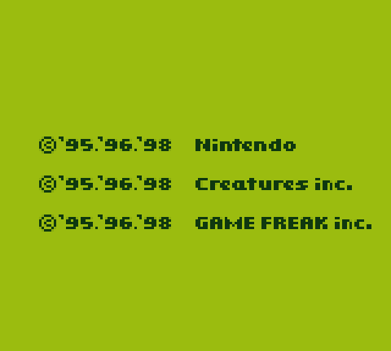
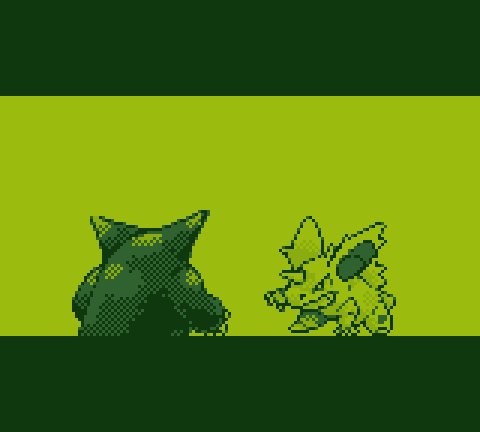

# sharpemu

Pokémon Red running on bare-metal x86-64. No operating system, no host emulator —
the machine boots from a USB stick straight into the game.



Written in x86-64 assembly, booted by its own bootloader, from a ROM built from
source out of the [pret/pokered](https://github.com/pret/pokered) disassembly and
verified by SHA-1.

| | |
| --- | --- |
|  |  |

---

## What it actually is

An SM83 (Game Boy) interpreter and PPU written in x86-64 assembly, plus a
bootloader, running with nothing underneath them. The Game Boy's CPU is
emulated; its hardware — the picture processing unit, timers, MBC3 cartridge
mapper, joypad, sound — is reimplemented against real PC hardware.

```
 boot sector  ─ 512B, INT 13h LBA load
      │
 stage 2      ─ A20, VBE video mode, unreal-mode load above 1MB
      │
 long mode    ─ 4GB identity paging
      │
 emulator     ─ SM83 interpreter · PPU · MBC3 · PS/2 · PC speaker · SRAM save
```

Roughly 4,900 lines of assembly and 3,300 lines of C# tooling.

## Why there is C# here

The assembly was not written blind. A complete Game Boy emulator was written in
C# first — CPU, memory map, PPU, APU — and used as a **reference oracle**. Both
implementations emit the same one-line-per-instruction trace format, so a
first-divergence diff points at a single opcode:

```
recomp trace pokered.gbc 30000 ref.txt      # C# reference
qemu ... -serial file:trace.txt             # the real thing
```

30,000 instructions matched exactly before the interpreter was trusted. Every
CPU bug found this way was located in one iteration rather than hunted through a
black screen. The same approach rendered the APU to a `.wav` so the sound could
be judged by ear before a line of audio assembly existed.

This turned out to be the single most valuable decision in the project.

## Status

**Works**

- Boots from USB on real hardware via legacy BIOS/CSM
- Full SM83 interpreter — verified against the reference for 30,000 instructions
- PPU: background, window, sprites, per-scanline, DMG palettes
- MBC3 ROM/SRAM banking, OAM DMA
- PS/2 keyboard
- Frame pacing at 59.7275 fps via TSC calibrated against the PIT
- SRAM saving to the boot device (**F5**), loaded automatically at boot

**Doesn't**

- **Sound is a PC speaker beeper.** Monophonic square wave: no bass,
  percussion, or harmony. Two better approaches (1-bit delta-sigma PWM,
  PIT timesharing) were built, tested and rejected as worse. Real fidelity
  needs an AC'97 driver, which is not written.
- No USB keyboard support of its own — relies on BIOS legacy emulation
- No link cable, no Game Boy Color features
- SRAM saving is verified in emulation but **the in-game save path is untested
  on real hardware**

## Building

Needs [RGBDS **v1.0.3** exactly](https://github.com/gbdev/rgbds/releases/tag/v1.0.3)
(the disassembly's `rgbdscheck.asm` rejects other versions), NASM, and a C#
compiler. QEMU is optional but recommended for testing.

```bash
git clone https://github.com/pret/pokered pokered-master
powershell -File recomp/build.ps1      # build the C# tooling
powershell -File build_rom.ps1         # build + SHA-1 verify pokered.gbc
powershell -File boot/mkdisk.ps1       # produce boot/sharpemu.img
```

`build_rom.ps1` replaces pret's Makefile — it discovers graphics targets by
scanning `INCBIN` directives, runs `rgbgfx`, and applies C# reimplementations of
pokered's `pkmncompress` and `gfx` helpers (so no C compiler is needed). It
finishes by checking the ROM against the official SHA-1.

### Running

```bash
powershell -File boot/run.ps1          # QEMU, windowed, with audio
```

Write `boot/sharpemu.img` to a USB stick with [Rufus](https://rufus.ie) in **DD
mode** for real hardware. Boot with CSM/Legacy enabled and Secure Boot off.

### Controls

| Key | |
| --- | --- |
| Arrows | D-pad |
| Z / X | A / B |
| Enter / Backspace | Start / Select |
| **F5** | Commit save to disk |

Save in-game first — F5 only flushes SRAM that the game has actually written.

## Some things that were interesting

**Saving requires leaving long mode.** `INT 13h` is the only interface that can
write to a USB stick, and it exists only in real mode. A save walks
long mode → 32-bit compatibility → paging off → LME off → 16-bit protected →
real mode → `INT 13h` → and all the way back. The page tables survive untouched,
so climbing back is just the original bring-up sequence.

**A missing `cld` caused a triple fault.** Multiboot doesn't guarantee the
direction flag is clear, so `rep stosd` ran *backwards* off the framebuffer into
unmapped memory.

**A one-line memory overlap produced a visible artifact.** The frame buffer is
`160*144 = 0x5A00` bytes, but a scratch buffer sat `0x1000` after it — clobbering
exactly scanline 25 from x=96 through scanline 26 to x=95. Found by comparing
per-row pixel sums against the C# renderer.

**QEMU cannot test PC speaker PWM.** Its `pcspk` device models the PIT tone
generator, not the speaker cone, so a delta-sigma bitstream is silent there.
Several rounds of audio work were spent learning this the expensive way.

## Legal

This repository contains **no Nintendo assets**. It builds a ROM from the
[pret/pokered](https://github.com/pret/pokered) disassembly, which requires
graphics and data from that project. The resulting `pokered.gbc` and any disk
image built from it contain copyrighted material and are excluded from version
control — build them yourself, and only if you're entitled to.

Pokémon and Game Boy are trademarks of Nintendo. This project is unaffiliated.

## Credits

- [pret/pokered](https://github.com/pret/pokered) — the disassembly this is built from
- [RGBDS](https://github.com/gbdev/rgbds) — Game Boy assembler toolchain
- [Pan Docs](https://gbdev.io/pandocs/) — Game Boy hardware reference
